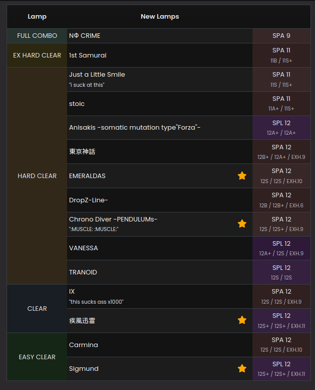

# Metrics

Metrics are what kind of values we want to track on this GPT's scores. Common things for this are values like `score`, `lamp`, maybe even `grade`.

A metric definition looks like this:

```ts
{
	type: "INTEGER",
	validate: p.isBetween(0, 100_000),
	formatter: FmtNum,
	description: "The score value.",
}
```

!!! note
	All metrics look like t

## Metric Types

We're allowed 5 types of metrics:

- `DECIMAL`

This metric is expected to be a decimal.

!!! example
	```ts
	percent: {
		type: "DECIMAL",
		validate: p.isBetween(0, 100),
		formatter: FmtPercent,
		description: "EX Score divided by the maximum possible EX Score on this chart.",
	},
	```

- `INTEGER`

This metric is expected to be a whole number.

!!! example
	```ts
	{
		type: "INTEGER",
		validate: p.isBetween(0, 100_000),
		formatter: FmtNum,
		description: "The score value.",
	}
	```

- `ENUM`

This metric is expected to be a string in a provided ordered list of strings. This is used to implement things like `"FAILED", "CLEAR", "FULL COMBO", "PERFECT"` lamps.

!!! example
	```ts
	{
		type: "ENUM",
		values: [
			"NO PLAY",
			"FAILED",
			"ASSIST CLEAR",
			"EASY CLEAR",
			"CLEAR",
			"HARD CLEAR",
			"EX HARD CLEAR",
			"FULL COMBO",
		],
		minimumRelevantValue: "EASY CLEAR",
		description: "The type of clear this was.",
	},
	```


- `GRAPH`

This metric is an array of numbers.

- `NULLABLE_GRAPH`

This metric is an array of numbers or null.

!!! example
	```ts
		gaugeHistory: {
			type: "NULLABLE_GRAPH",
			validate: p.isBetween(0, 100),
			description:
				"A snapshot of the gauge percent throughout the chart. The values should be null from the point the user dies until the end of the chart.",
		},
	```

	Importantly: something like `[99, 74, 12, null, null, null]` would be legal as a nullable graph.

	This does not mean the field itself is nullable, only the values inside the array!

## Enum Metrics

Metrics of type `ENUM` are special in many ways. Most importantly, they don't require
any sort of validation - the input is either a member of `values` or it isn't.

An ENUM metric looks like this: 
```ts
{
	type: "ENUM",
	values: [
		"NO PLAY",
		"FAILED",
		"ASSIST CLEAR",
		"EASY CLEAR",
		"CLEAR",
		"HARD CLEAR",
		"EX HARD CLEAR",
		"FULL COMBO",
	],
	minimumRelevantValue: "EASY CLEAR",
	description: "The type of clear this was.",
},
```

The order of `values` is extremely important: the first value should be the worst possible value in the metric, and the last value should be the best possible value.

`minimumRelevantValue` indicates the smallest value in this enum that a user will
ever realistically care about getting. This is used in the UI and other places to
hide useless ENUM values from the user.

!!! example
	

	Despite the fact this user failed a bunch of stuff this session, the UI won't
	show me my new `FAILED` or `ASSIST CLEAR` scores!

## Integer and Decimal Metrics

These kinds of metrics, given their more open-ended nature, require some validation.

### Validation

There are two kinds of metric validations. If a metric can be validated, it should have
a property called `validate` which returns true on success, and a string representing
an error message on failure:

!!! example
	```ts
	{
			type: "INTEGER",
			validate: (value) => {
				if (value > 100_000) { return "Score cannot be greater than 100k." }

				return true;
			},
			formatter: FmtNum,
			description: "The score value.",
	}
	```

!!! note
	The type of input is already checked for you. You don't need to check whether your
	input is an integer or not if you declare `type: "INTEGER"`. The same goes for
	`type: "GRAPH"`, the validator instead runs on each element in the array.

!!! tip
	The reason for this rather strange type signature (`string | true`) is because we
	can use our validation library - [Prudence](https://github.com/zkldi/Prudence) - to create validators for us. Instead
	of writing out that validation code, we can use `p.isBetween(0, 100_000)`!

However, it might not be possible to validate a metric without knowing what chart
the score is on. For example, in IIDX the maximum amount of score you can get is
the chart's notecount * 2.

Since we don't know what this GPT chart's look like at this time (we haven't defined them yet!)
we instead don't declare a validator and put down `chartDependentMax: true` instead.

We will have to write the validator later in the server implementation.

### Formatting

We also want to format these metrics into a string. For example, a `percent` metric may want to stringify into `92.45%` instead of `92.49938222293842`.
More subtle formatting rules can be defined here too, such as how in jubeat, scores are
easier to read written like `903,283` instead of `903283`.

## Graph Metrics

Graph metrics (`GRAPH` and `NULLABLE_GRAPH`) also have to define a validator, but the validator is called on each element of their respective arrays.

To validate that all of the values in a graph metric are between 0 and 10, you could
write a validator like:
```ts
function validate(value: number) {
	if (value < 0) return "too small";
	if (value > 10) return "too big";
	return true;
}
```

This is remarkably similar to how validators work for `INTEGER` and `DECIMAL` metrics.

Furthermore, graph metrics can specify a `size` function, which validates the size of
the array too. You can use this to enforce a certain array size (such as exactly 100 entries, or similar).

## Now what?

This is how metrics work, but there's more detail in how they're defined in each game's config.

For example, some metrics (like `grade` for a lot of games) are merely functions of other metrics. Making every import method handle this themselves seems silly. How do we tackle this? This, and more, is answered in [Metric Groups](./metric-groups.md)!